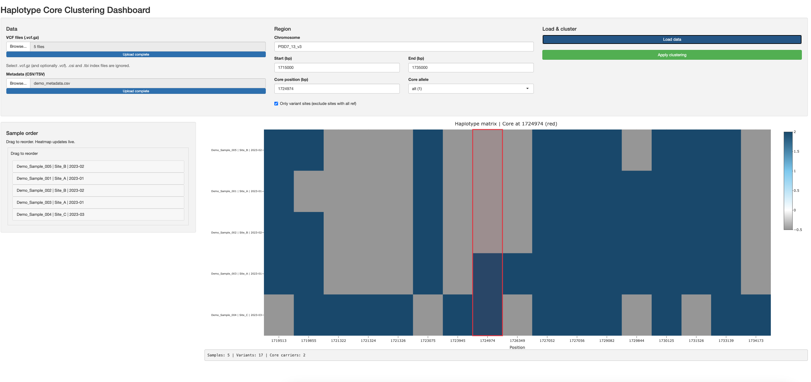

# Haplotype Core Clustering Tool

**Author:** George A. Tollefson

A standalone R tool for visualizing haplotype structure around a core allele under selection. Loads VCF or gVCF files, filters by region, and clusters samples by genotype similarity with emphasis on variants adjacent to the focal site.

Use cases: identifying core haplotypes in drug-resistance loci, tracking haplotype diversity around selected variants, and exploring sample clustering by shared genotype structure.



---

## Quick Start

```bash
# 1. Clone or download the repository, then cd into the tool folder
git clone https://github.com/YOUR_ORG/haplotype-tool.git
cd haplotype-tool/haplotype_tool

# 2. Install R packages (run once)
Rscript install.R

# 3. Launch interactive dashboard
Rscript haplotype_dashboard.R
```

The dashboard opens in your browser. Select VCF files, set the region, and load.

### Try the demo

1. In **Data**: Click **VCF files** and choose all 5 files from `demo_data/` (Demo_Sample_001.vcf.gz through Demo_Sample_005.vcf.gz). Click **Metadata** and choose `demo_data/demo_metadata.csv`.
2. In **Region**: Leave defaults (Chromosome: Pf3D7_13_v3, Start: 1715000, End: 1735000) or adjust as needed.
3. Click **Load data**. The heatmap will appear with samples ordered by clustering.
4. Use the **Sample order** panel to drag and reorder samples; the heatmap updates immediately.
5. Click **Apply clustering** to re-run clustering with the current settings.

---

## Requirements

- R >= 4.0
- R packages: vcfR, ggplot2, dplyr, tidyr, tibble, pheatmap, RColorBrewer, shiny, plotly, sortable

---

## Installation

Install dependencies from CRAN:

```bash
Rscript install.R
```

Or from within R:

```r
source("install.R")
```

---

## Usage

### Interactive Dashboard (recommended)

```bash
Rscript haplotype_dashboard.R
```

Or from R:

```r
shiny::runApp("haplotype_dashboard.R")
```

The dashboard provides:

- **Data**: Select VCF (.vcf.gz) and metadata (CSV/TSV)
- **Region**: Chromosome, start, end, core position, core allele
- **Load data**: Loads and filters VCF, runs clustering
- **Sample order**: Drag-and-drop reordering; heatmap updates live
- **Apply clustering**: Re-runs clustering and updates order

Heatmap hover shows position, DP, AF, and genotype per cell when available.

### Command-Line Clustering

For batch runs or scripting:

```bash
Rscript haplotype_core_cluster.R /path/to/vcf_dir \
  --chr Pf3D7_13_v3 \
  --start 1715000 \
  --end 1735000 \
  --core-pos 1724974 \
  --core-allele 1 \
  --outdir ./output \
  --prefix my_analysis
```

Interactive prompts (chromosome, region, core position):

```bash
Rscript haplotype_core_cluster.R /path/to/vcf_dir --interactive
```

### Command-Line Options

| Option | Description |
|--------|-------------|
| `vcf_dir` | Directory with VCF.gz files (required) |
| `--chr` | Chromosome/contig name |
| `--start` | Start coordinate (bp) |
| `--end` | End coordinate (bp) |
| `--core-pos` | Core allele position (bp); default: median of positions |
| `--core-allele` | 0 = reference, 1 = alternate (default) |
| `--pattern` | Glob for VCF files (default: `*.vcf.gz`) |
| `--metadata` | CSV/TSV for sample annotations |
| `--gvcf` | gVCF mode (depth at wildtype sites) |
| `--outdir` | Output directory (default: `haplotype_output`) |
| `--prefix` | Output file prefix |

---

## Outputs

From the command-line tool:

- **`*_heatmap.pdf`**: Genotype matrix (samples × variants), ordered by clustering. Core column highlighted.
- **`*_dendrogram.pdf`**: Hierarchical clustering dendrogram.
- **`*_cluster_summary.csv`**: Core carriers with cluster assignments.

---

## Metadata

Optional CSV/TSV for sample labels. Accepted columns (case-insensitive):

- **Sample ID**: `seq_sample_id`, `sample_id`, `sample`, `id`
- **Location**: `location`, `Origin.of.samples..HC.`, `collection_location`, `site`, `country`, `region`
- **Date**: `Date.of.storage`, `date_of_storage`, `date`, `sequence_date`, `collection_date`, `year`

Sample ID must match VCF column names. See `example/metadata_template.csv` for a template.

---

## gVCF Mode

For gVCF files (with reference blocks), use `--gvcf` in command-line mode. In the dashboard, load gVCF files directly; DP is extracted from FORMAT when present.

gVCF mode reports depth at wildtype sites, so you can distinguish:

- **0/0 with DP** = confirmed reference
- **./.** = missing

---

## Configuration

### Default region

The dashboard defaults to:

- Chromosome: `Pf3D7_13_v3`
- Start: 1715000
- End: 1735000

Edit the values in the UI or change defaults in `haplotype_dashboard.R`.

### Filtering variant sites

The "Only variant sites" checkbox (default: on) hides sites where all samples are reference. Uncheck to show all sites.

---

## Clustering

- **Distance**: Proximity-weighted Hamming; variants nearer the core contribute more.
- **Core split**: Large penalty between carriers and non-carriers.
- **Method**: Ward.D2 hierarchical clustering.
- **Interpretation**: Tight clusters with the same core and adjacent genotypes represent haplotypes most protected from recombination around the selected allele.

---

## File Layout

```
haplotype-tool/
└── haplotype_tool/
    ├── README.md
    ├── LICENSE
    ├── install.R
    ├── run_dashboard.sh           # Convenience launcher (optional)
    ├── haplotype_core_cluster.R   # CLI + core logic
    ├── haplotype_dashboard.R     # Shiny app
    ├── example/
    │   └── metadata_template.csv
    ├── demo_data/
    │   ├── Demo_Sample_001.vcf.gz ... Demo_Sample_005.vcf.gz
    │   └── demo_metadata.csv
    └── resources/
        └── example_dash_display_demo_data.png
```

---

## Troubleshooting

**"No VCF files found"** – Ensure files match the pattern (e.g. `*.vcf.gz`). Index files (.csi, .tbi) are ignored.

**Parser error on startup** – Check R version (>= 4.0) and that `install.R` completed without errors.

**DP not in hover** – DP appears when the VCF FORMAT includes DP (e.g. `GT:DP`). Some merged or converted VCFs drop it.

**Samples missing in metadata** – Sample ID column must match VCF column names exactly.

---

## Citation

If you use this tool in a publication, please cite the repository URL and acknowledge the author: George A. Tollefson.
